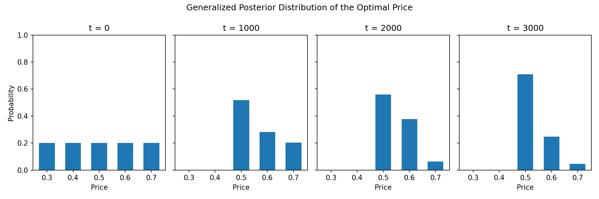

# A Minimalist Bayesian Framework for Stochastic Optimization

Paper: (https://arxiv.org/abs/2509.07030).

## Demonstration

See `demo.ipynb` for a demonstration of the Minimalist Thompson Sampling (MINTS) algorithm for dynamic pricing.
- Candidate prices: $0.3, 0.4, 0.5, 0.6, 0.7$. Let $p_j = (2 + j) / 10$.
- Valuation distribution of customers: $\mathcal{U} [0, 1]$ (unknown to the algorithm).
- Binary demand: given a posted price $p$, a customer with valuation $v$ makes a purchase if $v \geq p$.
- Unknown parameters: $\theta_j = \mathbb{P} ( v \geq p_j )$ for $j \in [5]$.
- Monotonicity constraints: $1 \geq \theta_1 \geq \cdots \geq \theta_5 \geq 0$.
- Lipschitz constraints: $| \theta_j - \theta_{j+1} | \leq |p_j - p_{j+1}|$ for $j \in [4]$.

We plot the generalized posterior distributions of the optimal price at specific times.

<p align="center">
    
</p>


## Experiments in the paper

To reproduce the numerical results in Section 5, please refer to the folder `Experiments`. 
- Use `pricing_experiments.ipynb` and `MAB_experiments.ipynb` to run the experiments. The main functions are written in `experiments.py`.
- The outcomes are stored in the compressed folder named `Data.zip`. For statistical analysis and visualization, please unzip the data folder and use `pricing_plots.ipynb` and `MAB_plots.ipynb`.


## Citation
```
@article{Wang2025,
  title={A Minimalist Bayesian Framework for Stochastic Optimization},
  author={Wang, Kaizheng},
  journal={arXiv preprint arXiv:2509.07030},
  year={2025}
}
```

