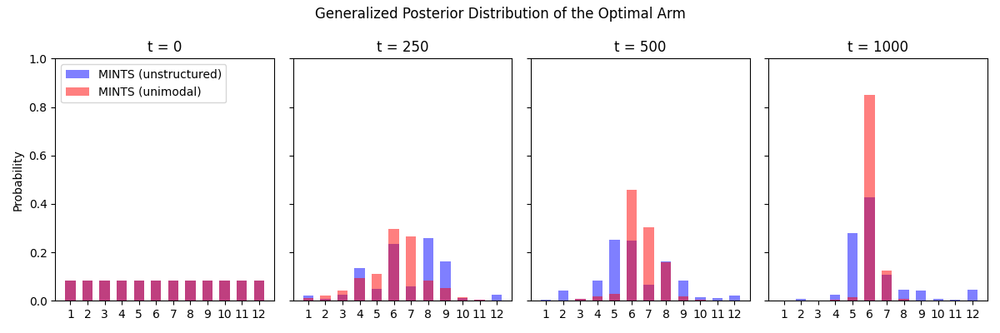
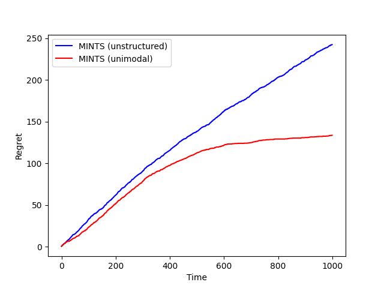

# MINTS: MINimalist Thompson Sampling

Paper: (https://arxiv.org/abs/2606.01655).

## Demonstration

See `demo.ipynb` for a demonstration of the MINimalist Thompson Sampling (MINTS) algorithm. The experiment uses a unimodal bandit as the test bed.

### Problem setup

Consider a bandit with $K$ arms and reward distributions $\lbrace P_j \rbrace _{j=1}^K$. Let $D_0 = \varnothing$ be an empty dataset. At time $t \geq 1$, we
- choose an arm $x_t \in [K]$ based on historical data $D_{t-1}$;
- observe a random reward $y_t \sim P_{x_{t}}$ and update our dataset to $D_t = D_{t-1} \cup \lbrace (x_t, y_t)  \rbrace$.

We want to find an arm with the highest expected reward through the above interaction protocal, without knowing the true reward distributions. Denote by $\mu_j = \mathbb{E}_{Y \sim P_j} Y$ the expected reward of arm $j$. Choose any $j^* \in \mathrm{argmax} _{j \in [K]} \mu_j$. Assume that $\lbrace \mu_j \rbrace _{j=1}^K$ satisfy the **unimodality** constraint:

$$ \mu_1 \leq \ldots \leq \mu_{ j^* } \qquad\text{and}\qquad \mu_{ j^* } \geq \ldots \geq \mu_K.$$

The MINTS algorithm maintains a distributional estimate of the optimal arm index $j^*$ to capture the uncertainties. In contrast, full Bayesian approaches (e.g., Thompson sampling) need to model all unknown parameters.

Starting from a prior distribution, such as the uniform distribution over $[K]$, MINTS conducts Bayesian-type belief updates as data comes in and nicely handles the constraints on model parameters. At each time $t$, a new arm $x_t$ is randomly sampled from a generalized posterior distribution of the optimal arm given data $D_{t-1}$.

### Experiment

Our demonstration uses $K = 12$, $\mu = (0, 0.1, 0.2, 0.3, 0.4,$**0.7**$, 0.5, 0.5, 0.4, 0.2, 0.2, 0.1)$, and $P_j = N(\mu_j, 1)$. By construction, $j^* = 6$. We test two versions of the MINTS algorithm with uniform prior and Gaussian likelihood:
- unstructured version: no constraint imposed on the unknown mean parameter $\mu$;
- unimodal version: use the fact that $\mu \in \Theta_1 \cup \cdots \cup \Theta_K$, where $\Theta_j = \lbrace \theta \in \mathbb{R}^K :~ \theta_1 \leq \ldots \leq \theta_{ j } \text{ and } \theta_{j} \geq \ldots \geq \theta_K \rbrace$.

Below we plot how the generalized posterior distributions of the optimal arm evolve over time.

<p align="center">
    
</p>

The unimodal MINTS has faster posterior contraction than the unstructured version, showing the benefit of incorporating structural constraints. This is also supported by the following comparison of cumulative regret.

<p align="center">
    
</p>

## Experiments in the paper

To reproduce the numerical results in Section 6, please refer to the folder `Experiments`. 
- Use `MAB_experiments.ipynb` to run the experiments. The main functions are written in `experiments.py`.
- The outcomes are stored in the compressed folder named `results.zip`. For statistical analysis and visualization, unzip the data folder and use `summary.ipynb`.

## Acknowledgement

This repository was developed with coding assistance from Claude Sonnet 4.6 and GPT-5.4.

## Citation
```
@article{Wang2026,
  title={MINTS: Minimalist Thompson Sampling},
  author={Wang, Kaizheng},
  journal={arXiv preprint arXiv:2606.01655},
  year={2026}
}
```

